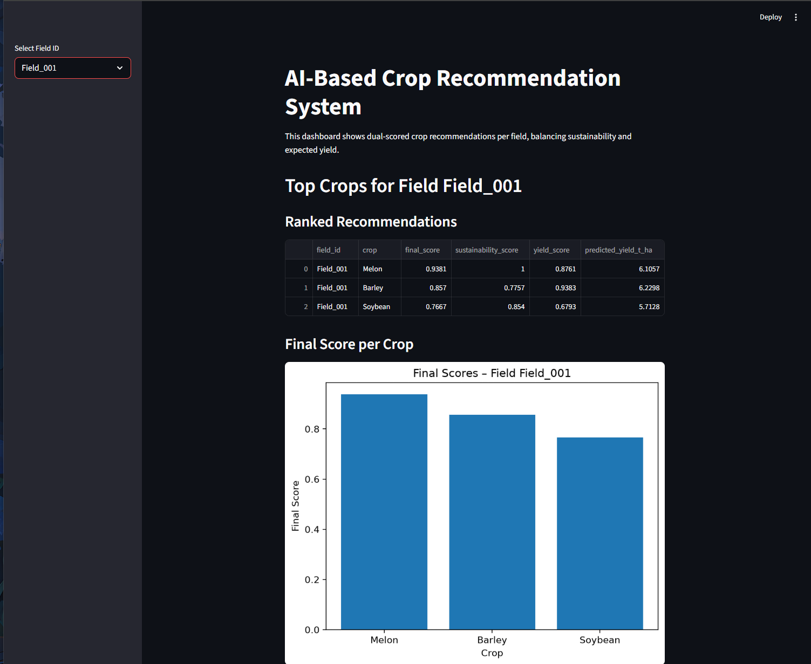
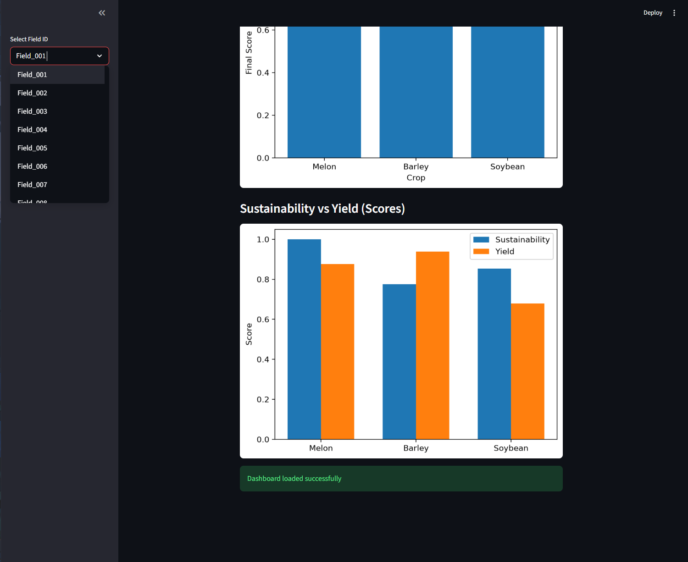
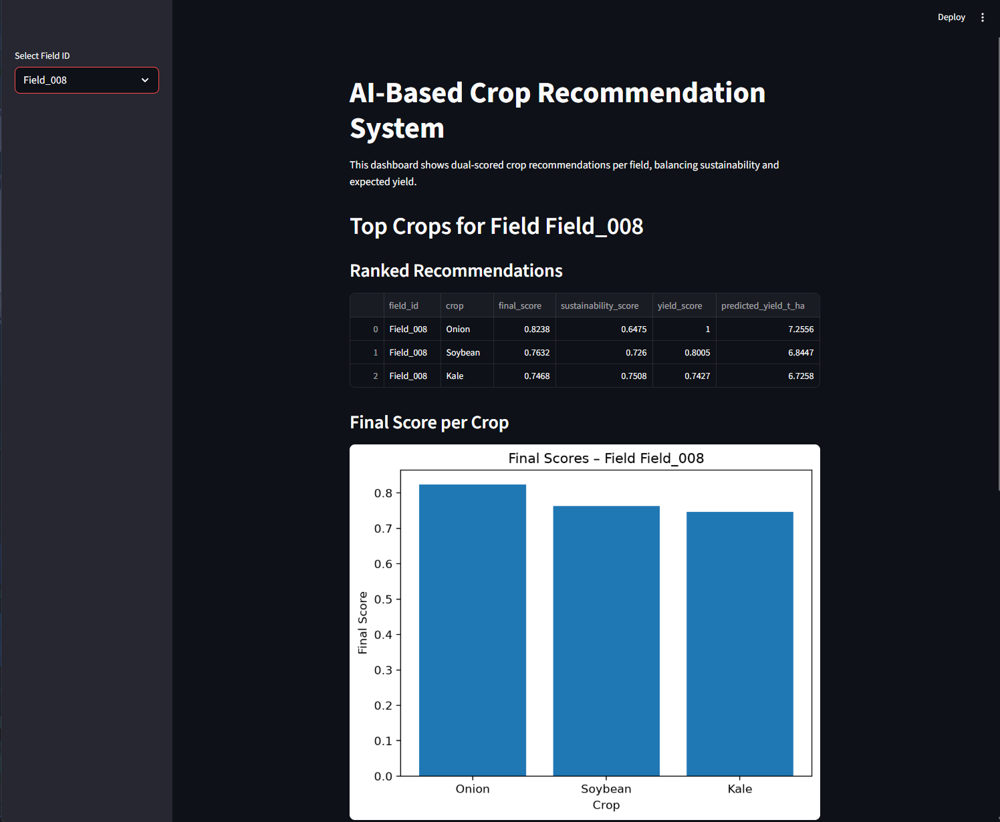
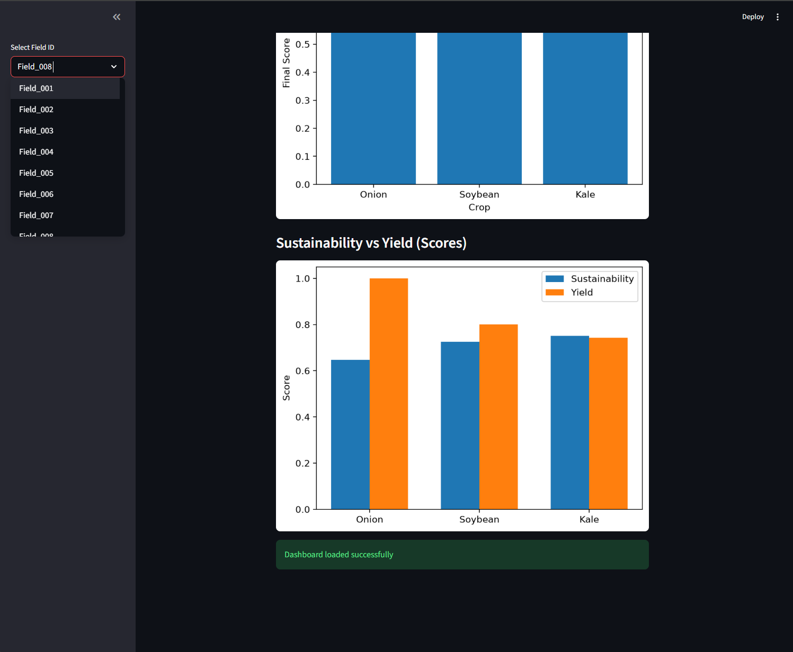

# Crop Recommendation System

This project ranks crop options for each field by combining two signals:

- predicted yield from a trained Random Forest model
- sustainability score based on water, soil, nutrient, and pH fit

The final output is shown in a Streamlit dashboard.

## Dashboard Preview

### Field 001 Recommendations





### Field 008 Recommendations





## Project Files

```text
app.py                       Streamlit dashboard
rank_crops.py                Generates ranked crop recommendations
train_yield_model.py         Trains the yield prediction model
utils.py                     Data cleaning helper functions
current_conditions_data.csv  Current field conditions
field_historical_data.csv    Historical field/yield data
crop_profiles_data.csv       Crop requirement/profile data
crop_recommendations.csv     Generated ranking output
docs/images/                 Dashboard screenshots
```

## Install

Install Python 3.10 or newer. Then install the required packages:

```bash
pip install -r requirements.txt
```

## Run The Dashboard

Since `crop_recommendations.csv` is already included, you can open the dashboard directly:

```bash
streamlit run app.py
```

## Regenerate The Results

To rebuild everything from the CSV data, run:

```bash
python train_yield_model.py
python rank_crops.py
streamlit run app.py
```

The first command creates `models/yield_model.joblib`. The model file is not included in this repository because it is generated and can be rebuilt from the CSV data.

On Windows, you can also double-click:

```text
run_all.bat
```

## Outputs

- `models/yield_model.joblib`: trained model saved by `train_yield_model.py`
- `crop_recommendations.csv`: top crop recommendations saved by `rank_crops.py`
